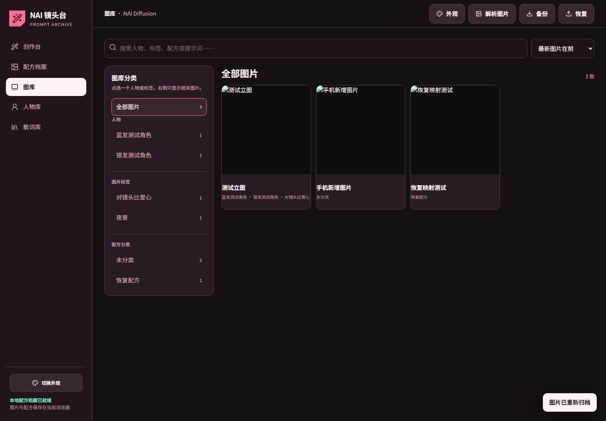
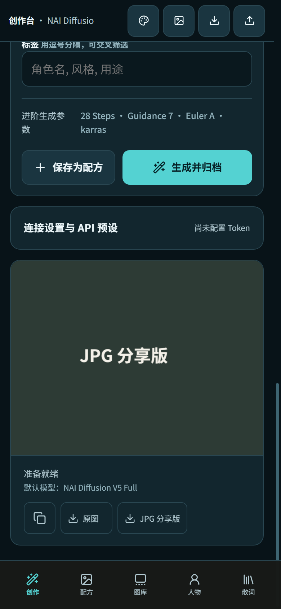

# NAI 镜头台

一个本地优先的 NovelAI 生图与提示词档案工具。

它把画面描述、人物、画师串、正面词、负面词、模型参数与生成图片保存在同一份可检索档案里，适合需要反复试图、整理配方和复用提示词的个人创作者。

> 非 NovelAI 官方项目，与 Anlatan / NovelAI 无隶属或合作关系。



## 使用方式

### 在线使用

仓库启用 GitHub Pages 后，可从仓库右侧的 **Deployments** 或 **About** 区域进入在线版。

在线版的数据只保存在当前浏览器中。更换浏览器、清理网站数据或使用无痕模式，都可能导致本地档案丢失；请定期使用工具内的“备份”功能下载 JSON 备份。

### 下载单文件版

[下载 v2.7 单文件版](download/nai-lens-studio-v2.7-standalone.html)

下载后直接用浏览器打开即可。单文件版已经内嵌主程序、ZIP 解析组件和标题字体，适合保存到电脑或发送到手机使用。

## 主要功能

- 支持 NAI Diffusion V5 Full、V5 Curated、V4.5 与 V3。
- 分开编辑和复制画面描述、人物提示词、画师串、正面词与负面词。
- 以“配方档案”保存画师风格、常用参数、备注、来源和对应作品。
- 人物库支持结构化外貌字段及多人同时选用。
- 散词库支持画面描述、画师串、正面词、负面词和整套配方。
- 图库可按人物、图片标签和配方聚合筛选。
- 导入 NovelAI PNG 并读取其中仍然保留的提示词和生成参数。
- 下载保留元数据的原图，或重新编码为不携带 PNG 提示词文本块的 JPG 分享版。
- JSON 全量或日期范围备份；恢复时与本机数据合并并跳过新版重复项。
- 桌面与手机响应式界面，包含四套本地外观主题。



## 第一次使用

1. 打开“连接设置与 API 预设”。
2. 选择 NovelAI 官方直连或你信任的兼容站点。
3. 填写自己的 Token / API Key。不要使用他人分享的未知凭据。
4. 先点击“套用低成本测试参数”，生成一张小图确认连接。
5. 创建配方、人物或散词后，再开始长期归档。
6. 有重要数据后立即下载一次完整备份。

## 数据与隐私

- 项目没有自己的服务器、账号系统或云端图库。
- 图片、配方、人物和散词保存在浏览器 IndexedDB 中。
- Token 默认只保留在当前页面会话；只有用户主动选择“记住”时才写入浏览器本地存储。
- JSON 备份不包含 Token、接口预设或外观设置。
- 生图请求会发送到用户自己填写或选择的服务地址；请只使用可信服务商。

详细说明见 [PRIVACY.md](PRIVACY.md)。如果报告安全问题，请先阅读 [SECURITY.md](SECURITY.md)。

## 已知限制

- 浏览器前端不能绕过服务端 CORS。官方直连出现 `Failed to fetch` 时，通常需要改用明确允许浏览器请求的可信接口。
- 第三方站点是否支持 V5、请求参数和返回格式，由该站点决定。
- PNG 经截图或社区平台压缩后，提示词元数据可能已经丢失。
- JPG 分享版会产生有损压缩，透明区域会变成白色；它不代替原图归档。
- 尚未使用真实 Token 完成扣费型端到端测试，首次使用请从低成本参数开始。

## 本地运行与开发

直接打开 `index.html` 可以使用大多数功能。若浏览器限制本地文件能力，可在仓库目录启动任意静态文件服务器后访问。

公开版结构：

```text
index.html                         在线版入口
assets/nai-studio.js               主程序
assets/jszip.min.js                ZIP 解析依赖
assets/nai-title.ttf               标题字体子集
download/nai-lens-studio-*.html    可独立运行的单文件版
screenshots/                       项目预览图
licenses/                          第三方许可证
```

## 反馈与贡献

欢迎通过 GitHub Issues 报告问题或提出建议。请不要在截图、日志或 Issue 中粘贴 Token、API Key、私人反代地址或包含隐私的提示词与图片。

提交修改前请阅读 [CONTRIBUTING.md](CONTRIBUTING.md)。版本变化见 [CHANGELOG.md](CHANGELOG.md)。

## 许可证与商标

项目自有代码使用 [MIT License](LICENSE)。JSZip 与 Noto Serif SC 字体保留各自许可证，详见 [THIRD_PARTY_NOTICES.md](THIRD_PARTY_NOTICES.md)。

“NovelAI”是其权利人的商标。本项目名称仅用于说明兼容用途，不代表官方认可、赞助或合作。

